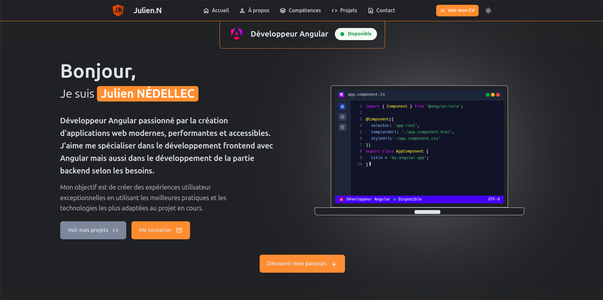

# 🚀 Portfolio Personnel - Application Angular 20



## 📋 Présentation

Application de portfolio personnel moderne développée avec Angular 20, conçue pour présenter mes compétences, projets et expériences professionnelles. Cette plateforme offre une interface élégante et responsive avec un panel d'administration complet pour la gestion dynamique du contenu.

## ✨ Fonctionnalités

- **Interface utilisateur moderne** : Design responsive avec animations fluides
- **Gestion des projets** : Présentation interactive des projets avec filtres et pagination
- **Section compétences** : Affichage des compétences techniques et certifications
- **Formulaire de contact** : Système de contact avec envoi d'emails automatisé
- **Panel d'administration** : Interface complète pour la gestion du contenu
- **Système d'authentification** : Accès sécurisé à l'interface d'administration
- **Analytics** : Suivi des visites et interactions
- **Génération de CV** : Export automatique du CV en PDF

## 🛠️ Prérequis

- Node.js (version 18.x ou supérieure)
- pnpm (version 8.x ou supérieure)
- Angular CLI (version 20.x)

## 🚀 Installation et démarrage

### 1. Cloner le projet

```bash 
git clone https://github.com/djoudj-dev/ng-portfolio-app.git
cd ng-portfolio-app
```

### 2. Installer les dépendances

```bash
pnpm install
```

### 3. Configuration de l'environnement

Configurez les variables d'environnement dans le fichier :

```
src/environments/environment.development.ts
```

Exemple de configuration :

```typescript
export const environment = {
  production: false,
  apiUrl: 'http://localhost:3000'
};
```

### 4. Lancer le serveur de développement

```bash
pnpm start
```

L'application sera accessible à l'adresse : [http://localhost:4200](http://localhost:4200)

## 🔄 Configuration du backend

Cette application frontend nécessite le backend NestJS disponible ici : [nest-portfolio-app](https://github.com/djoudj-dev/nest-portfolio-app)

Assurez-vous que le backend est démarré sur le port 3000 avant de lancer l'application frontend.

## 🏗️ Structure du projet

```
src/
├── app/
│   ├── core/                    # Services et guards essentiels
│   │   ├── guards/              # Guards de sécurité
│   │   ├── interceptors/        # Intercepteurs HTTP
│   │   └── services/            # Services core (auth, etc.)
│   ├── features/                # Modules fonctionnels
│   │   ├── about/               # Section à propos
│   │   ├── admin/               # Panel d'administration
│   │   ├── analytics/           # Système d'analytics
│   │   ├── badge/               # Gestion des badges
│   │   ├── contact/             # Formulaire de contact
│   │   ├── cv/                  # Génération de CV
│   │   ├── landing/             # Page d'accueil
│   │   ├── projects/            # Gestion des projets
│   │   └── skills/              # Compétences et certifications
│   └── shared/                  # Composants et services partagés
│       ├── animations/          # Animations personnalisées
│       └── ui/                  # Composants UI réutilisables
├── assets/                      # Ressources statiques
└── environments/                # Configuration des environnements
```

## 🎯 Technologies Utilisées

### Frontend
- **Angular 20** : Framework frontend moderne
- **Tailwind CSS 4** : Framework CSS utilitaire
- **TypeScript** : Langage de programmation typé
- **RxJS** : Programmation réactive
- **Vitest** : Framework de test moderne
- **ESLint** : Linting du code
- **Prettier** : Formatage automatique du code

### Backend (API)
- **NestJS** : Framework Node.js
- **TypeScript** : Langage typé
- **PostgreSQL** : Base de données
- **Prisma** : ORM moderne

## 🧪 Tests et qualité du code

### Lancer les tests

```bash
# Tests unitaires
pnpm test

# Tests en mode watch
pnpm test:watch

# Tests avec exécution unique
pnpm test:run
```

### Vérification de la qualité du code

```bash
# Linting
pnpm lint

# Formatage automatique
pnpm format

# Vérification complète
pnpm code:check

# Pre-commit (lint + format)
pnpm pre-commit
```

### Build et analyse

```bash
# Build de production
pnpm build

# Analyse du bundle
pnpm build:analyze

# Workflow complet local
pnpm workflow:local
```

## 📱 Fonctionnalités détaillées

### Interface Publique
- **Hero Section** : Présentation avec animation du laptop
- **À propos** : Informations personnelles et liens sociaux
- **Compétences** : Visualisation des technologies maîtrisées
- **Projets** : Galerie interactive avec filtres par technologie
- **Contact** : Formulaire avec validation et envoi d'email

### Panel d'Administration
- **Dashboard** : Vue d'ensemble des statistiques
- **Gestion des projets** : CRUD complet des projets
- **Messages** : Consultation des messages de contact
- **Analytics** : Graphiques de suivi des visites
- **Badges** : Gestion des badges de compétences
- **CV** : Génération et téléchargement du CV

## 🔐 Sécurité

- Authentification JWT
- Guards de protection des routes admin
- Intercepteur d'authentification automatique
- Validation côté client et serveur
- Protection CSRF

## 🚀 Déploiement

Pour déployer en production :

```bash
# Build optimisé
pnpm build

# Les fichiers sont générés dans dist/
```

## 🤝 Contribution

Les contributions sont les bienvenues ! N'hésitez pas à ouvrir une issue ou à soumettre une pull request.

## 📝 Licence

Ce projet est personnel et à des fins de démonstration de compétences.

---

Développé avec ❤️ par [Djoudj](https://github.com/djoudj-dev)
